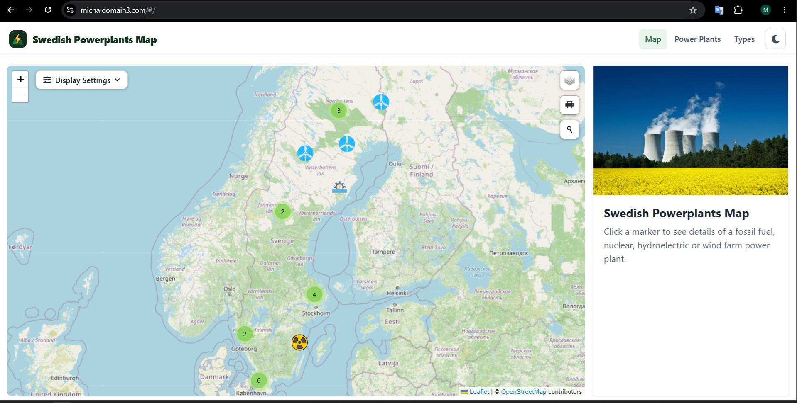
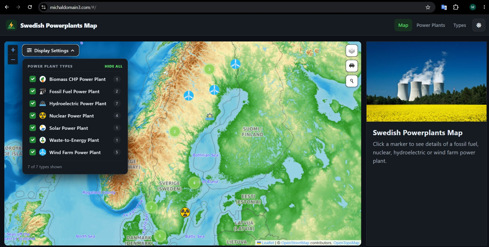
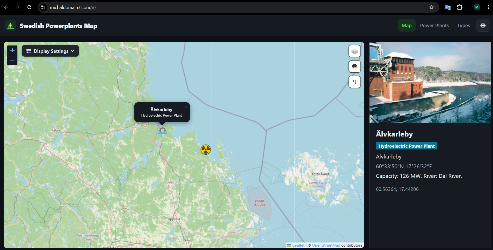
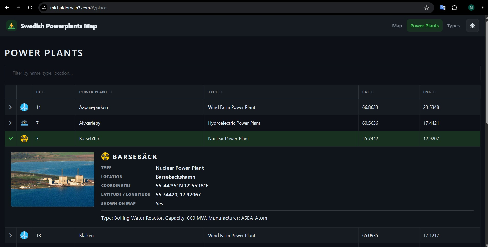
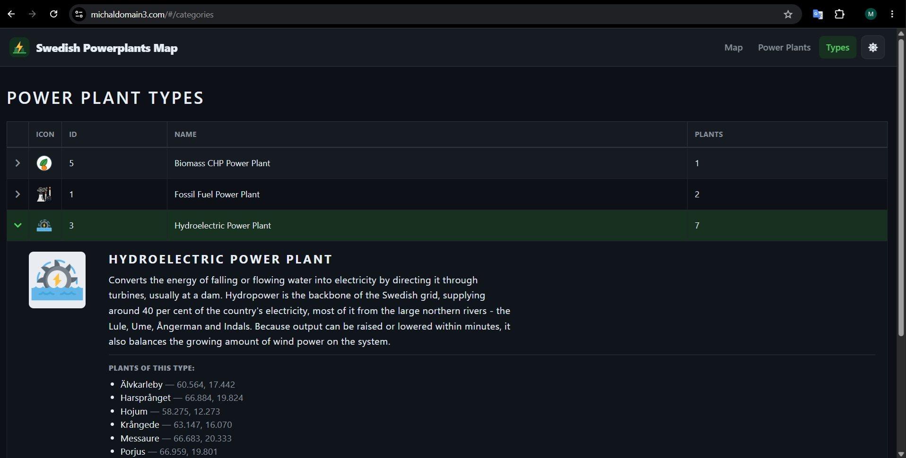
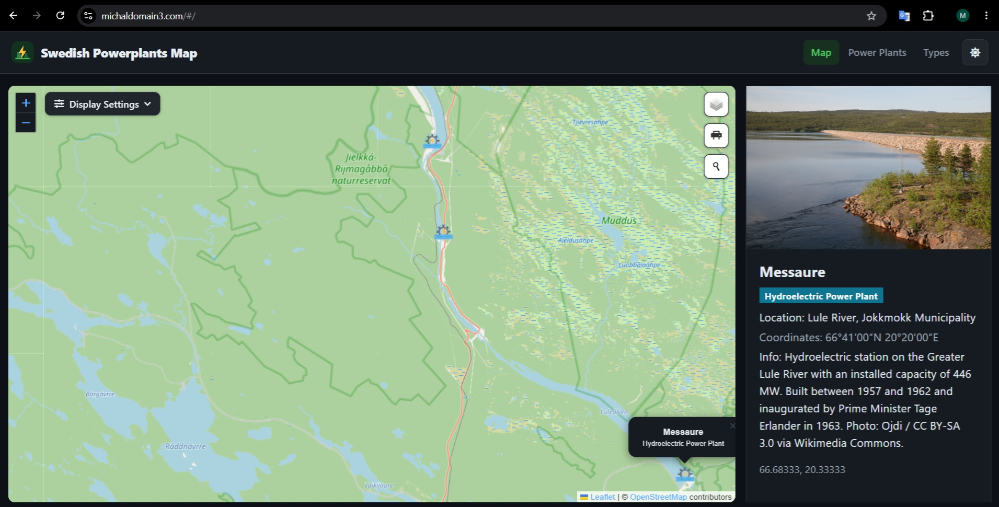

# Swedish Powerplants Map — Django & React Application

## Overview

A full-stack web application combining a Django backend with a React frontend,
deployed on AWS infrastructure. It maps Sweden's power plants — fossil fuel,
nuclear, hydroelectric, wind, biomass CHP, waste-to-energy and solar — on an
interactive Leaflet map backed by cloud storage and a managed database.

## 🌍 Live Application: **https://michaldomain3.com/**

The application is deployed on AWS Elastic Beanstalk and is publicly available at
**[michaldomain3.com](https://michaldomain3.com/)** (also reachable at
[www.michaldomain3.com](https://www.michaldomain3.com/)). All traffic is served
over HTTPS; plain HTTP is redirected with a 301.

---

## Architecture

### Backend–Frontend Communication

The two sides communicate exclusively through a REST API. React never imports
Python code; Python never imports JavaScript. The binding points are HTTP
endpoints and a development proxy rule.

### Django & React Integration

There is exactly one Django template: the compiled React `index.html`. Django
serves the pre-built React shell and the API; React owns the client-side
interface from there. Routing uses `HashRouter`, so every screen lives under
`/#/…` and Django needs only a single URL route.

### Authentication

JWT authentication via `djangorestframework-simplejwt`. Tokens are stored in
`localStorage` and sent as `Bearer` headers on protected requests — no sessions
or cookies at the API layer. The map and both tables are public; creating,
editing and deleting require a signed-in user.

### Plain Django, not GeoDjango

The project began on GeoDjango with a PostGIS `PointField`. It was converted to
plain Django because it ran no spatial queries at all, and GEOS/GDAL/PROJ are
native libraries absent from the Elastic Beanstalk platform. Coordinates are two
`FloatField`s. The REST API was unchanged by the move — it always exposed flat
`latitude`/`longitude` numbers — and `/api/places/geojson/` still returns a
GeoJSON `FeatureCollection` for QGIS and similar clients.

### Features

- Five base map layers: OpenStreetMap, Carto Light, Carto Dark, OpenTopoMap, Esri Satellite
- Marker clustering, place search and a print-to-PDF control
- A **Display Settings** panel over the map to show or hide each plant type
- Expandable detail rows on the Power Plants and Types tables
- Light and dark themes

---

## Deployment Versions

Two versions live under `Swedish_Power_Plants/`: a self-contained local version
and the AWS-integrated production version.

### Local Version — `Swedish_Power_Plants/Local_version`

Runs with **no database server, no AWS account and no configuration file**.
SQLite is part of Python, the compiled React bundle is committed, and the plant
photos are served from disk.

```
pip install -r requirements.txt
python manage.py migrate
python manage.py import_data
python manage.py runserver
```

Then open <http://127.0.0.1:8000/>. Create an account with
`python manage.py createsuperuser` to use the editing screens.

### AWS-Integrated Version — `Swedish_Power_Plants/AWS_version`

**Required Dependencies:**
- AWS account with an S3 bucket (public read; ACLs disabled)
- PostgreSQL RDS database (public access enabled; no PostGIS extension needed)
- `django-storages`, `boto3`, `psycopg2-binary`, `gunicorn`, `awsebcli`

**Setup Steps:**

```
eb init
eb create
eb setenv IS_PRODUCTION=true SECRET_KEY=... NAME=... DB_USER=... PASSWORD=... \
          HOST=... AWS_ACCESS_KEY_ID=... AWS_SECRET_ACCESS_KEY=... \
          AWS_STORAGE_BUCKET_NAME=...
eb deploy

python manage.py import_data          # seed the RDS database
python manage.py upload_media_to_s3   # push photos and icons to the bucket
```

`.ebextensions/01_python.config` runs `migrate` and `collectstatic --clear` on
the leader instance during every deployment.

**Configuration Required:**
- S3 bucket for user-uploaded media (the React build is served by WhiteNoise, not S3)
- Environment variables in Elastic Beanstalk: `SECRET_KEY`, database credentials,
  AWS credentials, bucket name
- An inbound rule on the RDS security group allowing TCP 5432 from the
  environment's EC2 security group
- For a custom domain: an ACM certificate, an HTTPS :443 listener, a 301
  redirect on :80, and Route 53 alias records

**No credentials are committed.** Every secret is read from the environment and
defaults to empty; the application refuses to start without a `SECRET_KEY`.

---

## Screenshots












